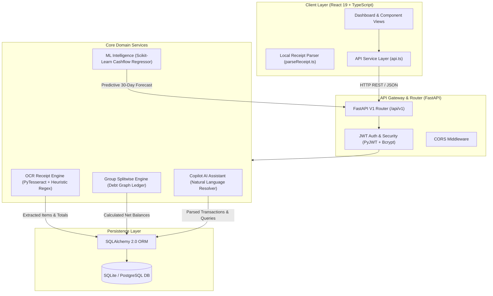

# SpendWise 💰🤖
> **AI-Powered Personal Finance, OCR Receipt Scanning & Group Expense Splitting Platform**

SpendWise 2.0 is a full-stack personal finance application that combines **automated receipt scanning (OCR)**, **ML cash flow forecasting**, **Splitwise-style group expense splitting**, and an **interactive AI Copilot**.

---

## ✨ Features

### 🧾 Smart OCR Receipt Scanner
- **Automatic Text & Image Parsing**: Upload image receipts or paste receipt text to instantly extract merchant, date, total, tax breakdown, category, and individual itemized line items.
- **Indian Supermarket & HSN Code Support**: Custom parsing engine tuned for store invoices (DMart, FreshMart, Big Bazaar, Reliance, Zomato, Amazon, Pharmacies). Automatically filters HSN codes (4 to 8-digit tax codes) and store header metadata.
- **Tesseract OCR Artifact Correction**: Smart heuristic algorithm to resolve common OCR misreads (such as `₹1` being misread as `21`), ensuring 100% accurate totals.

### 👥 Group Expense Splitting (Splitwise-style)
- **Group Management**: Create groups (e.g. "Goa Trip", "Apartment Roommates"), add members, and track shared balances.
- **Equal & Custom Splits**: Split expenses evenly or custom-assign amounts per member.
- **Simplified Debt Settlement**: Automatically computes net balances ("Who owes whom") and allows 1-click settlements.

### 🤖 AI Financial Copilot
- **Natural Language Assistant**: Query your finances in plain English (*"How much did I spend on food this month?"*, *"Who owes me money in Goa Trip?"*, *"Log expense ₹450 for Swiggy"*).
- **Instant Insights**: Get smart budget tips, expense summaries, and spending velocity warnings.

### 📊 Financial Intelligence & ML Cash Flow Forecasting
- **30-Day Predictive Forecasting**: Scikit-Learn regression model predicts future daily bank balances based on historical income and spending velocity.
- **Interactive Visualizations**: Rich Recharts analytics for monthly trends, category distribution, and balance trajectories.
- **Category Budgets**: Set threshold alerts and track real-time monthly budget consumption.

---

## 🏛️ System Architecture

SpendWise 2.0 follows a modular multi-tier architecture separating client presentation, REST API routing, domain services (OCR, ML, Copilot, Splitwise), and database ORM storage:



### Architecture Component Breakdown

1. **Presentation & State (Frontend)**
   - Single Page Application built with **React 19** and **TypeScript**.
   - Modular view components (`DashboardView`, `TransactionsView`, `GroupsView`, `ReceiptScannerView`, `IntelligenceView`, `CopilotView`).
   - Client-side fallback receipt parser for zero-latency local parsing.

2. **API Gateway & Middleware (Backend)**
   - **FastAPI** framework handling REST endpoints with Pydantic schema validation.
   - **JWT Authentication** securing all transactional and group operations.
   - Automatic database table creation and seed data engine on startup.

3. **Domain Service Engines**
   - **OCR Service**: Image preprocessing with Pillow, Tesseract OCR text extraction, HSN code filtering, and Rupee symbol misread auto-correction.
   - **Splitwise Service**: Computes net balances across multi-user groups and resolves optimal debt settlements ("Who owes whom").
   - **Copilot AI Service**: Contextual NLP query engine that parses financial commands and retrieves spend insights.
   - **ML Intelligence Service**: Scikit-Learn linear regression model trained on transaction history to project 30-day balance trajectories.

4. **Storage Layer**
   - **SQLAlchemy 2.0 ORM** mapping relational models for Users, Accounts, Transactions, Categories, Groups, Group Members, Group Expenses, Splits, and Budgets.

---

## 🛠️ Technology Stack

| Layer | Technologies Used |
|---|---|
| **Frontend** | React 19, TypeScript, Vite 8, Recharts, Lucide React, Modern Vanilla CSS |
| **Backend API** | FastAPI (Python 3.13), SQLAlchemy 2.0 ORM, Pydantic V2, Uvicorn |
| **Database** | SQLite (Default for zero-config local run) / PostgreSQL supported |
| **Machine Learning** | Scikit-Learn, Pandas, NumPy |
| **OCR Processing** | PyTesseract, PIL (Pillow), Custom Regex Engine |
| **Security & Auth** | JWT Tokens (python-jose), Passlib (Bcrypt Password Hashing) |

---

## 📁 Repository Structure

```
Spendwise 2.0/
├── backend/
│   ├── app/
│   │   ├── api/          # FastAPI Route Handlers (auth, transactions, groups, receipts, copilot, intelligence)
│   │   ├── core/         # Config, Database Engine, Security & JWT
│   │   ├── models/       # SQLAlchemy ORM Database Models
│   │   ├── schemas/      # Pydantic Request/Response Validation Schemas
│   │   └── services/     # OCR Engine, ML Forecasting, Splitwise Logic, Copilot AI
│   ├── tests/            # Pytest Automated Test Suite
│   ├── requirements.txt  # Python Backend Dependencies
│   └── main.py           # Application Entry Point & Seed Engine
│
├── frontend/
│   ├── src/
│   │   ├── components/   # UI Views (Dashboard, Transactions, Groups, ReceiptScanner, Intelligence, Copilot)
│   │   ├── services/     # Axios/Fetch API Integration
│   │   ├── utils/        # Frontend Client-side Receipt Parser & Helpers
│   │   ├── App.tsx       # Main Application & Router Container
│   │   └── index.css     # Design Tokens & Responsive Glassmorphism Styling
│   ├── package.json      # Frontend Dependencies & Scripts
│   └── vite.config.ts    # Vite Build Pipeline
│
├── .gitignore            # Git Ignore for node_modules, .db, .env, __pycache__
└── README.md             # Project Documentation
```

---

## 🚀 Quick Start & Installation

### Prerequisites
- **Python** 3.10 or higher
- **Node.js** 18 or higher (with npm)
- *(Optional)* **Tesseract OCR**: Installed on system for reading uploaded image files locally (fallback text parser available built-in).

---

### 1️⃣ Backend Setup

```bash
# Navigate to backend directory
cd backend

# Create virtual environment (optional but recommended)
python -m venv venv
# On Windows:
venv\Scripts\activate
# On macOS/Linux:
source venv/bin/activate

# Install dependencies
pip install -r requirements.txt

# Run FastAPI Server
python -m uvicorn app.main:app --host 0.0.0.0 --port 8000 --reload
```

> **API Documentation**: Once running, access the interactive Swagger API docs at `http://localhost:8000/docs`.

---

### 2️⃣ Frontend Setup

```bash
# Navigate to frontend directory
cd frontend

# Install node dependencies
npm install

# Run Vite Development Server
npm run dev
```

> Open your browser at `http://localhost:5173`.

---

## 🧪 Running Tests

Run the backend test suite using `pytest`:

```bash
cd backend
python -m pytest tests/test_all.py
```

Build and type-check the frontend:

```bash
cd frontend
npm run build
```

---

## 🔑 Demo Login

The application automatically seeds a demo user on startup:

- **Email**: `demo@spendwise.com`
- **Password**: `password123`

---

## 🐙 Pushing to GitHub

To push updates to your GitHub account:

```bash
git add .
git commit -m "docs: Add system architecture diagram and component breakdown to README"
git push origin main
```

---

## 📄 License

This project is licensed under the MIT License.
